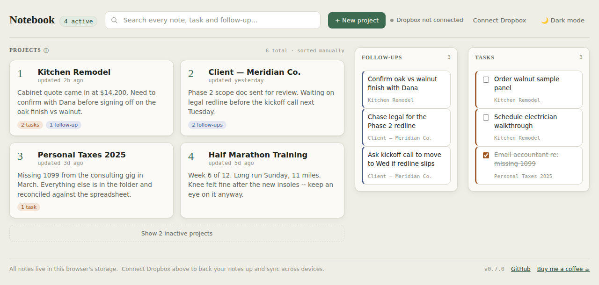
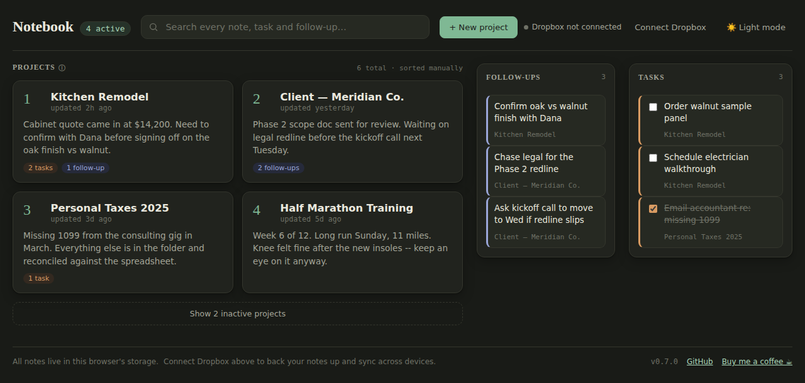
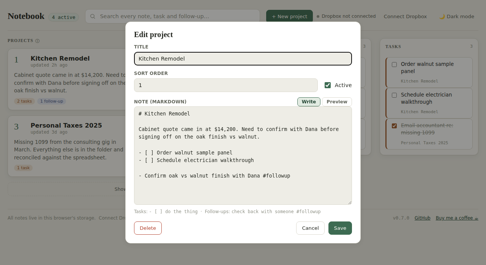
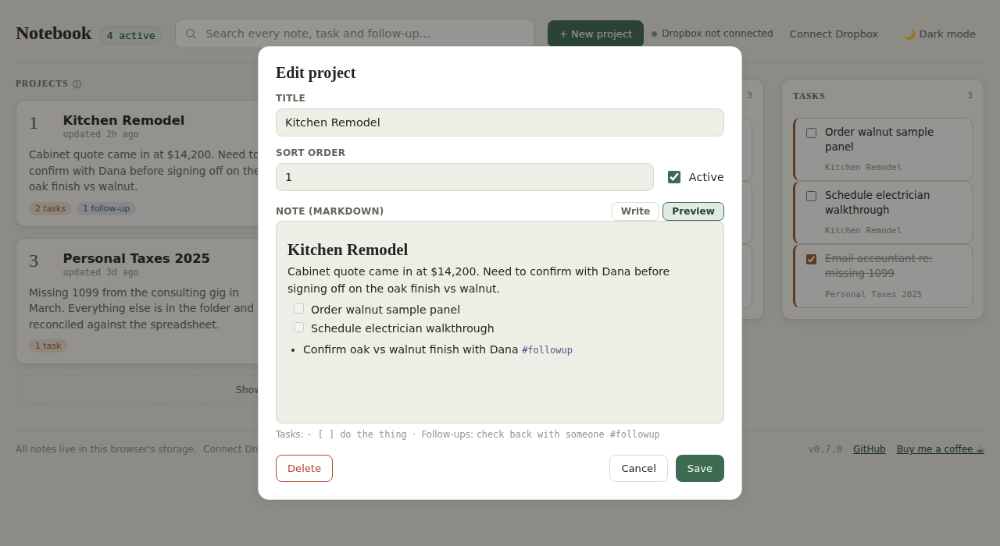

# Notebook

**Live:** https://adambeltz2.github.io/Simple-Productivity/

A single dashboard of "projects" — each one an editable markdown note. The
dashboard numbers your **active** projects (1 through N, in the sort order
you choose), shows a preview of each note, and pulls every `- [ ] task` and
`#followup`-tagged line out of your notes into two always-visible rails on
the right. A header search box searches across every note, task, and
follow-up at once.

It's local-first and entirely client-side: there's no backend, no database,
no account required. Everything lives in this browser's `localStorage`.
Dropbox is an optional, add-on backup/sync layer — never the source of
truth.

## What it looks like

The dashboard — active projects numbered and sorted your way, with
Follow-ups and Tasks pulled out into their own rails on the right:



Dark mode is a real explicit toggle (top right), not just a system
preference — it remembers your choice:



Each project is an editable markdown note, written plain:



...or rendered, via the editor's Write/Preview toggle — headings, bold,
lists, task checkboxes, and `#followup` tags all shown as they'd actually
read:



The dark mode toggle defaults to your OS preference the first time, then
remembers whatever you pick. Hovering the ⓘ next to "Projects" shows the
task/follow-up syntax as a quick reference.

This is a sibling project to [Simple Gantt](https://github.com/adambeltz2/Simple-Gantt)
and deliberately follows the same architecture: one static `index.html`,
vanilla JS, no build step, no framework.

## Running it

There's no build step. Any of these work:

```bash
# open it directly
open index.html

# or serve it (recommended -- matches how it behaves once deployed)
npx http-server -p 4173 .
```

## Note format

Each project is a title, an `active` flag, a `sortOrder`, and a markdown
`body`. **Every project is its own file the moment it leaves the browser** —
this is deliberate: Dropbox sync (below) represents each project as its own
individual `.md` file, with frontmatter for `title`/`active`/`sortOrder`
above the body, e.g.:

```markdown
---
title: "Kitchen Remodel"
active: true
sortOrder: 1
---
Cabinet quote came in at $14,200. Need to confirm with Dana before signing
off on the oak finish vs walnut.

- [ ] Order walnut sample panel
- Confirm oak vs walnut finish with Dana #followup
```

That means a project's note can be edited directly in Dropbox, or downloaded
and edited in any text editor and re-uploaded — Notebook detects it and
offers to pull it in (see "Dropbox sync" below), without touching any other
project.

Within the body:

- **Tasks** use standard markdown checkbox syntax:
  ```markdown
  - [ ] Order walnut sample panel
  - [x] Email accountant re: missing 1099
  ```
- **Follow-ups** use a hashtag, anywhere on the line:
  ```markdown
  - Confirm oak vs walnut finish with Dana #followup
  ```
  (`#followup Confirm oak vs walnut finish with Dana` also works — the tag
  can lead or trail; everything else on the line is the follow-up text.)
- The first non-heading lines of the body become the dashboard preview.
- A `# Heading` on its own line is used as the title if one wasn't set
  explicitly.

Only **active** projects are numbered on the dashboard and feed the Tasks /
Follow-ups rails. Inactive projects are kept (collapsed behind a "Show N
inactive projects" toggle) rather than deleted, so archiving a project never
loses its notes.

## Dropbox sync

Dropbox is connected: a scoped app is registered in the [Dropbox App Console](https://www.dropbox.com/developers/apps)
with its redirect URI set to this app's deployed URL, and its **app key**
(never the app secret — this is a static SPA with no server to keep a
secret on, so the OAuth2 implicit grant is used instead) is set as
`DROPBOX_APP_KEY` in `index.html`. This browser's `localStorage` remains
authoritative; Dropbox is only ever a copy, and nothing is ever pulled in
from it without an explicit confirmation.

**Layout in Dropbox:** `/Notebook Projects/<slugified-title>.md` — one flat
folder, one file per project, overwritten in place on every backup. No
subfolders, no internal ids: browsing that folder looks like nothing more
than a folder of markdown files. A project's filename is derived from its
title, so **renaming a project's title renames its Dropbox file too** —
the next backup uploads under the new name and deletes the stale file
under the old one. This is also how an imported file with a generic name
(say you drop a `test.md` straight into the Dropbox folder) sorts itself
out: import it, give it a real title, save, and its file becomes
`the-real-title.md` — `test.md` doesn't linger. (This only applies to
renames made through the app's Title field; a file renamed directly in
Dropbox isn't matched back to its project — see `BACKLOG.md`.)

**On connect** (and on reconnecting after a session expires), two things
happen right away: every real project is pushed to Dropbox, and Notebook
checks every `.md` file in that folder against what it already knows —
both a file that doesn't match any known project (added directly in
Dropbox, or synced from another device) **and** a file whose name matches
a known project but whose content differs (hand-edited directly in
Dropbox) are surfaced, tagged "new" or "changed" respectively, in one
checklist. Nothing is ever imported or applied silently.

**"Check Dropbox"** (topbar, once connected) re-runs that same check any
time — this is how you see a change you just made directly in Dropbox
show up here: edit the project's `.md` file in Dropbox, then click "Check
Dropbox" (or just reconnect) and confirm it in the checklist that appears.

**After an edit**, a backup is pushed automatically ~60 seconds after you
stop editing (not on every keystroke). The dot next to the Dropbox button
and the status text both track exactly what's happening: an idle amber dot
+ "backup pending" while waiting out the debounce, a pulsing amber dot +
"syncing…" while the upload is actually in flight, and a green dot +
"synced Xm ago" once it settles — so it's never ambiguous whether a change
has actually made it to Dropbox yet.

**Sample projects never touch Dropbox.** The handful of onboarding notes
Notebook seeds into a brand-new browser (Kitchen Remodel, and the rest) are
placeholders, not real data — they're skipped by every backup, so opening
the app in a fresh/private browser never pushes demo content into your
real Dropbox. The moment you edit one and hit Save, or Dropbox turns up
real data to import, it stops being a placeholder: an edited sample starts
backing up like anything else, and importing real data from Dropbox clears
out whatever samples you hadn't touched — so there's nothing to manually
purge.

**Deleting a project** also deletes its file from Dropbox, if connected.

See `BACKLOG.md` for what's still open (every project is re-uploaded on
each auto-backup even if only one changed; cross-device conflict handling
for edits to the *same* project between backups).

## Versioning

`APP_VERSION`, shown in the page footer, is bumped on every deploy-intended
change:

1. Bump `APP_VERSION` in `index.html` (semver: `MAJOR.MINOR.PATCH`).
2. Add an entry to `CHANGELOG.md` under a new version heading.
3. Commit both together.

## Testing

```bash
npm install
npx playwright test
```

Specs live in `tests/`. Per `CLAUDE.md`, any user-visible change to
`index.html` ships with a spec update in the same change — see
`CLAUDE.md` §5.

## Project docs

- `CLAUDE.md` — engineering conventions and the tech-stack decisions above.
- `CHANGELOG.md` — what shipped, by version.
- `BACKLOG.md` — deferred features, bugs, and debt (see `CLAUDE.md` §4 for
  the tagging convention).
